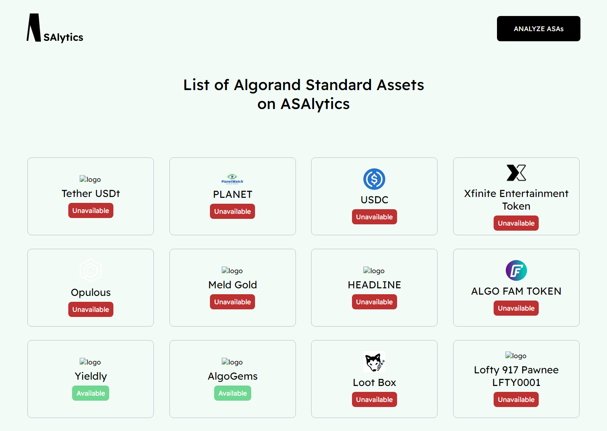

# ASAlytics - Coding Assessment

This is the solution to the [Coding Assessment of ASAalytics](https://asalytics.notion.site/asalytics/Coding-Assessment-9a4efe06095e40fca787e9eca8b9cac0).

## Table of contents

-  [Overview](#overview)
   -  [The challenge](#the-challenge)
   -  [Screenshot](#screenshot)
   -  [Links](#links)
   -  [Built with](#built-with)
-  [Author](#author)
-  [Acknowledgments](#acknowledgments)

## Overview

### The challenge

The challenge of the assessment was

-  Create page with UI like the image above, you can also check the Figma board for the design https://www.figma.com/file/LvSfu5VicspNx58c3EK2el/Untitled?node-id=1%3A1174
-  Connect to GraphQL server. API is located at https://analytics-api.herokuapp.com/analytics
-  Explore API via GraphQL interface, and try to come up with query you should use to fetch needed data. You are to display all ASAs on the UI.
-  Push your solution to Github, deploy on your favourite Hosting Provider

Users should be able to:

-  View the optimal layout depending on their device's screen size
-  See all the necessary content rendered on the UI

### Screenshot

### Links

-  Solution URL: [Add solution URL here](https://your-solution-url.com)
-  Live Site URL: [Add live site URL here](https://your-live-site-url.com)

### Built with

-  Semantic HTML5 markup
-  CSS custom properties
-  Flexbox
-  CSS Grid
-  React
-  Material UI
-  GraphQL
-  React Query
-  Jest Testing Lirary

## Author

-  LinkedIn - [@jubrilosunkoya](https://www.linkedin.com/in/jibreel-osunkoya/)
-  Portfolio - [jbs-blueprint.me/my-portfolio](https://www.jbs-blueprint.me/my-portfolio/)

## Acknowledgments

I'll like to thank the ASAlytics team for giving me an opportunity to showcase my skills towards this project as I also learnt many things during this project. I'm looking foward to working with you in the future.
